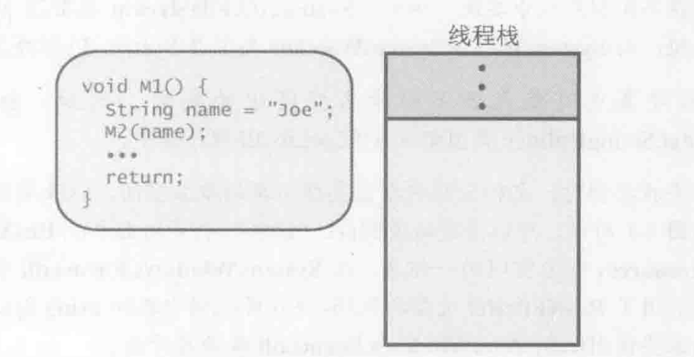
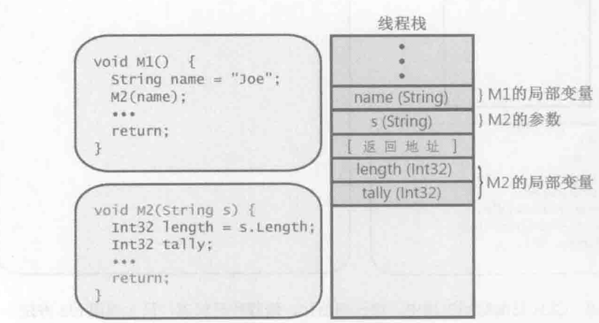
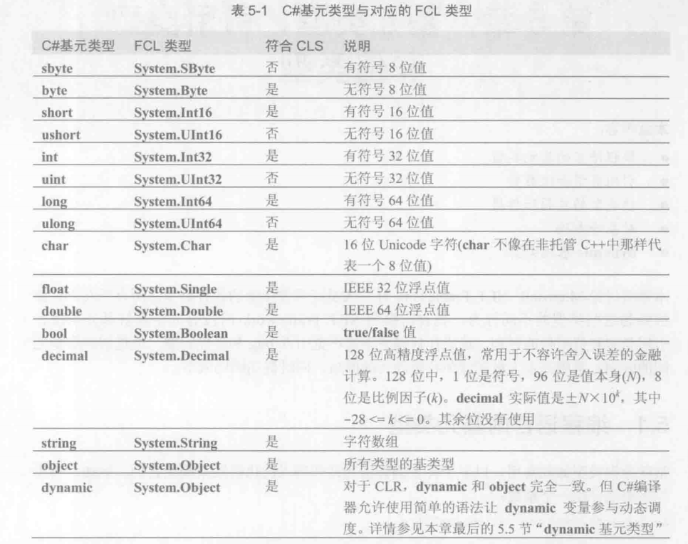

# CLR的执行模型
**CRL**(公共语言运行时)是一个可由多种编程语言使用的**运行时**
 
**CTS**(Common Type System 通用类型系统)制定一个正式规范来描述类型的定义和行为

**CLS**(Common Language Specification 公共语言规范)定义了一个最小功能集,任何编译器只有支持这个功能集,生成的类型才能兼容由其它符合CLS、面向CLR的语言生成的组件

---

## 第4章 类型基础
CRL要求所有类型都从System.Object派生, 所以下面两个类的父类都是`Object`
```c#
// 隐式派生自Object
class Employee{
	...
}

// 显式派生自Object
class Employee : System.Object{
	...
}
```

<br>

System.Object的公共方法
- Equals: 判断两个对象具有相同的值
- GetHashCode: 返回对象的值的哈希码
- ToString: 默认返回类型的完整名称
- GetType: 返回从Type派生的一个类型的实例


new计算类型及其所有基类型中定义的所有实例字段需要的字节数,在堆上每一个对象都需要额外成员,例类型对象指针(type object pointer)和同步块索引(sync block index),CLR利用这些管理成员对象大小,同样额外的字段也要计入大小

CLR采用垃圾回收机制,所以new没有对应delete操作符
  
CLR通过GetType方法获取对象的类型

C#不要任何过多的语法即可将对象转换成它的任何父类型,子转父是**隐式安全**.父转子需要显示转换,这是**不安全**的,编译可以通过但转换失败会抛出**InvalidCastException**异常
```c#
// 隐式转换
Object o = new Pserson();
// 显示转换
Person p = o as Person;
```
<br/>

**is**检查对象是否兼容指定类型,返回true则兼容而false则不兼容, **永远不会抛出异常**. 如果对象为null则总是返回false. 
这里做了两次类型检查,会造成性能影响
is 做一次检查判断o是否兼容Person这个类型
当o转成Person类型,CLR又做了一次类型检查,所以C#提供**as**操作符
```c#
if (o is Person){
	Person p = (Person)o
	// 在if语句使用p
}
```
<br/>

**as**检查对象是否兼容指定类型,返回对象引用则兼容而返回null则不兼容, **永远不会抛出异常**.
这里做了一次类型检查,当用as转换为Person类型时
```c#
Person p = o as Person
if (p != null){
	// 使用p
}
```
<br/>

命名空间对相关的类型进行分组,易于通过命名空间定位类型.例微软**Microsoft**命名空间有一个类**Widget**,而我们的**Wintellect**同样有**widget**类, 当同时引用这个命名空间,就会造成编译错误**CS0140: Widget是Microsoft.Widget和Wintellect.Widget**之间的不明确引用
```c#
using Microsoft;
using Wintellect;

public static viod Main()
{
	// 不明确引用
	Widget w = new Widget();
}
```

需要确定命名空间

```c#
using Microsoft;
using Wintellect;

// 为Wintellect.Widget起别名
using WintellectWidget = Wintellect.Widget;

public static viod Main()
{
	// 不明确引用
	Widget w = new WintellectWidget();
}
```

<br/>
<br/>

### 4.4运行时的相互状态


1. 在字符串池中查找有没有joe这个字符串,有的话直接将**内存地址**赋值给name, 没有就初始化一块内存空间存入joe字符串,将**内存地址**赋值给name
2. 将name的值压入栈中
3. 调用M2方法



1. 给变量length, tally分配内存空间, 访问线程栈的**s**实参,将长度赋值给length
2. 执行M2方法内的代码
3. 到达reture, 需要就**s**实参出栈
4. 同样执行完M1后续代码也要出栈 

如果代码访问尚未显式初始化的局部变量, C#会报造错误消息: **使用了未赋值的nn变量**

---

## 第5单 基元类型、引用类型和值类型
编译器直接支持的数据类型称为**基元类型**。基元类型直接映射到Framework类库(FCL)中存在的类型。例C#的int直接映射到System.Int32类型,生成的IL完全相同
```C#
int				a = 0; // a最好
System.Int32			a = 0; // b
int				a =  new int(); // c
System.Int32		        a =  new System.Int32(); //d最差
```

<br/>

#### 基元类型与对应的FCL类型图


