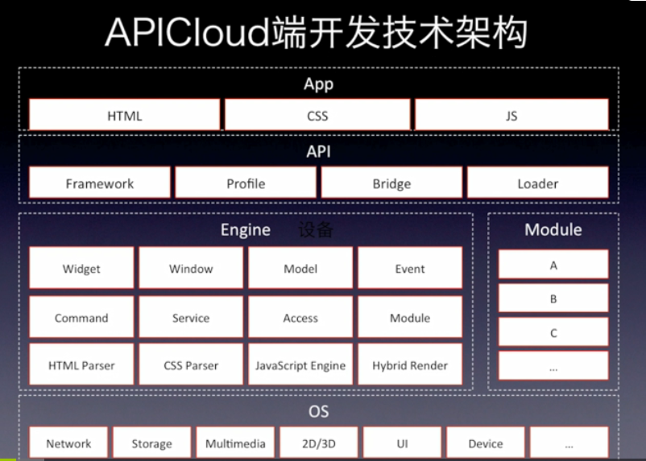
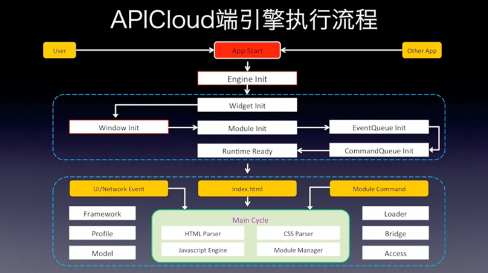
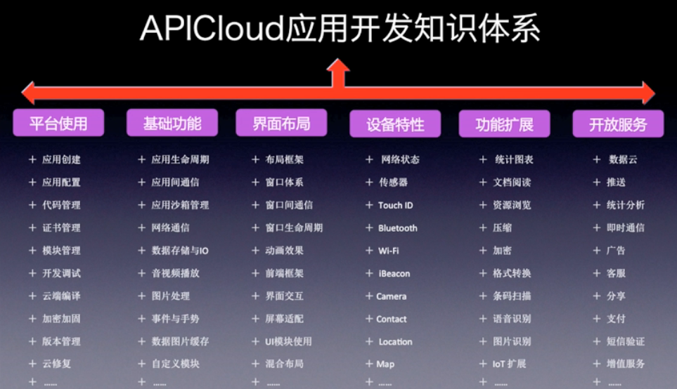

### apicloud产品构成
由端引擎, 云引擎, 在线应用开发平台, 开发者服务及工具组成

端引擎:  
app: 需要基础的web开发技能  
api: 由apicloud提供出来的api,是对安卓原生接口的做了封装,类似于c与lua的关系.这些接口功能在原生的web技术无法提供.
- framework:apicloud的ui框架
- profile: 兼容微信,支付宝
- loader:开发时用到哪些模块由它进行加载
- bridge:将开放的api转化成指令,再传给下层engine*匹配并调用*原生安卓api.类似于windows操作的SSDT表,这个表存储3环api对应的0环api映射指令(index).这个index是数字类型

engine:封装了安卓原生api的接口,按功能分为12部分

-  Widget: 每一个应用都是一个widget,管理应用的调用,生命周期,沙箱
-  Window: 整个应用的窗口管理
-  Model: 在数据云中定义的模型返回前端
-  Event: 由消息对队进行事件的统一管理 
-  Command: 由命令对队进行命令的提取和调用
-  Service: 推送及其它的一些服务
-  Access: 本地沙箱,数据io,访问权限的控制
-  Module: 
-  HTML parser:
-  CSS parser:
-  Javascript engine:
-  Hybird Render: 界面的渲染

事件驱动:

apicloud应用设计思想:
- client+dloud架构,前后端分离
- 每一个界面都是独立的window或frame
- 不要引入大太的js和css框架,因为每个界面都有单独的dom树
- HTML5不支持的或实现有问题的,使用模块

应用开发知识体系:

